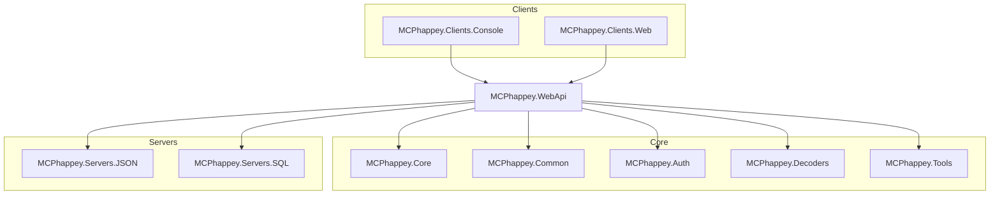

# MCPhappey

**MCPhappey** is a modular implementation of the Model Context Protocol (MCP). It enables dynamic, multi-domain server hosting, authentication, dynamic client registration and tool/resource integration—built for extensibility and rapid innovation.

---

## Modular Architecture



MCPhappey is designed for composability: swap, extend, or compose servers, tools, and clients as needed.

---

## Packages

| Package                      | Type    | Purpose                                         |
|------------------------------|---------|-------------------------------------------------|
| MCPhappey.Core               | Core    | Dynamic server logic, AI/memory, abstractions   |
| MCPhappey.Common             | Core    | Shared models/utilities                         |
| MCPhappey.Auth               | Core    | OAuth2/OpenID Connect endpoints (Azure AD, PKCE)|
| MCPhappey.Decoders           | Core    | Content decoders (e.g., EPUB, Graph)            |
| MCPhappey.Tools              | Tool    | Integrations: Bing, GitHub, OpenAI, SharePoint  |
| MCPhappey.Servers.JSON       | Server  | Static JSON-configured MCP servers              |
| MCPhappey.Servers.SQL        | Server  | Dynamic SQL-backed MCP servers                  |
| MCPhappey.Clients.Console    | Client  | CLI for discovering/interacting with MCP servers|
| MCPhappey.Clients.Web        | Client  | React web client for MCP servers                |
| MCPhappey.WebApi             | Host    | Web API host for MCPhappey                      |

---

## Tech Stack

- **Core:** .NET 9, ModelContextProtocol
- **Optional:** Azure AD, SQL Server, OpenAI, Microsoft Graph
- **Test/Dev:** React 19 (web client), Bootstrap

---

## Getting Started

1. **Build all projects:**
   ```sh
   dotnet build
   ```
2. **Run the Web API:**
   ```sh
   dotnet run --project src/MCPhappey.WebApi
   ```
3. **(Optional) Start the web client:**
   ```sh
   cd src/MCPhappey.Clients/MCPhappey.Clients.Web
   npm install
   npm run dev
   ```

---

## Contributing

- Clean code, best practices, and “living on the edge” (NoWarn, latest tech).
- Modular by design: add new servers, tools, or clients with minimal friction.

---

## More Info

- Each package contains its own README.md for details and usage.
