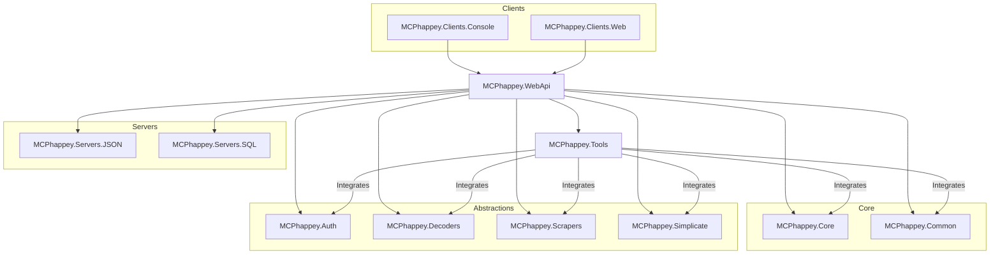

# MCPhappey

**MCPhappey** is a next-generation, modular implementation of the Model Context Protocol (MCP). It enables dynamic, multi-domain server hosting, authentication, dynamic client registration, and tool/resource integration—built for extensibility, rapid innovation, and “living on the edge” with the latest tech.

---

## Ecosystem Overview

| Package                                                                 | Type         | Description                                      |
|--------------------------------------------------------------------------|--------------|--------------------------------------------------|
| [MCPhappey.Core](src/Core/MCPhappey.Core/README.md)                      | Core         | Dynamic server logic, AI/memory, abstractions    |
| [MCPhappey.Common](src/Core/MCPhappey.Common/README.md)                  | Core         | Shared models/utilities                          |
| [MCPhappey.Auth](src/Abstractions/MCPhappey.Auth/README.md)              | Abstraction  | OAuth2/OpenID Connect endpoints                  |
| [MCPhappey.Decoders](src/Abstractions/MCPhappey.Decoders/README.md)      | Abstraction  | Content decoders (EPUB, Graph, etc.)             |
| [MCPhappey.Scrapers](src/Abstractions/MCPhappey.Scrapers/README.md)      | Abstraction  | HTTP, Outlook, SharePoint scrapers               |
| [MCPhappey.Simplicate](src/Abstractions/MCPhappey.Simplicate/README.md)  | Abstraction  | Simplicate API scraper                           |
| [MCPhappey.Tools](src/Abstractions/MCPhappey.Tools/README.md)            | Tools        | Bing, GitHub, OpenAI, SharePoint integrations    |
| [MCPhappey.Servers.JSON](src/Servers/MCPhappey.Servers.JSON/README.md)   | Server       | Static JSON-configured MCP servers               |
| [MCPhappey.Servers.SQL](src/Servers/MCPhappey.Servers.SQL/README.md)     | Server       | Dynamic SQL-backed MCP servers                   |
| [MCPhappey.Clients.Console](src/Clients/MCPhappey.Clients.Console/README.md) | Client   | CLI for discovering/interacting with servers     |
| [MCPhappey.Clients.Web](src/Clients/MCPhappey.Clients.Web/README.md)     | Client       | React web client for MCP servers                 |
| [MCPhappey.WebApi](src/Samples/MCPhappey.WebApi/README.md)               | Sample/Host  | Web API host for MCPhappey                       |

---

## Architecture



---

## How It All Fits Together

- **Clients** (Console, Web) interact with the **WebApi** host, which orchestrates all core, abstraction, and tool packages.
- **Core** provides the dynamic server logic, AI/memory, and shared abstractions.
- **Abstractions** (Auth, Decoders, Scrapers, Simplicate) encapsulate authentication, content decoding, and data extraction.
- **Tools** offer integrations with external services (Bing, GitHub, OpenAI, SharePoint, etc.).
- **Servers** (JSON, SQL) provide static and dynamic MCP server implementations.
- **WebApi** is the main entry point for web-based access, integrating all packages.

---

## Getting Started

1. **Build all projects:**
   ```sh
   dotnet build
   ```
2. **Run the Web API:**
   ```sh
   dotnet run --project src/Samples/MCPhappey.WebApi
   ```
3. **(Optional) Start the web client:**
   ```sh
   cd src/Clients/MCPhappey.Clients.Web
   npm install
   npm run dev
   ```

---

## Contributing

- Clean code, best practices, and “living on the edge” (NoWarn, latest tech).
- Modular by design: add new servers, tools, or clients with minimal friction.
- See each package’s README for deep dives and extension points.

---

## Further Reading

- [MCPhappey.Core](src/Core/MCPhappey.Core/README.md)
- [MCPhappey.Common](src/Core/MCPhappey.Common/README.md)
- [MCPhappey.Auth](src/Abstractions/MCPhappey.Auth/README.md)
- [MCPhappey.Decoders](src/Abstractions/MCPhappey.Decoders/README.md)
- [MCPhappey.Scrapers](src/Abstractions/MCPhappey.Scrapers/README.md)
- [MCPhappey.Simplicate](src/Abstractions/MCPhappey.Simplicate/README.md)
- [MCPhappey.Tools](src/Abstractions/MCPhappey.Tools/README.md)
- [MCPhappey.Servers.JSON](src/Servers/MCPhappey.Servers.JSON/README.md)
- [MCPhappey.Servers.SQL](src/Servers/MCPhappey.Servers.SQL/README.md)
- [MCPhappey.Clients.Console](src/Clients/MCPhappey.Clients.Console/README.md)
- [MCPhappey.Clients.Web](src/Clients/MCPhappey.Clients.Web/README.md)
- [MCPhappey.WebApi](src/Samples/MCPhappey.WebApi/README.md)

---
