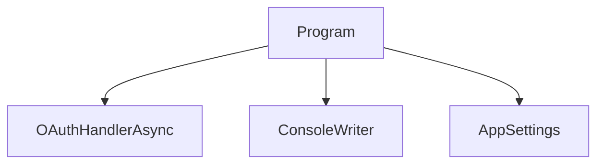

# MCPhappey.Clients.Console

CLI tool for discovering and interacting with MCP servers.

## Architecture



## Key Features
- Lists and connects to MCP servers
- Invokes tools and reads resources
- Supports OAuth authentication

## Usage

```sh
dotnet run
```

## Dependencies
- MCPhappey.Core
- MCPhappey.Common
