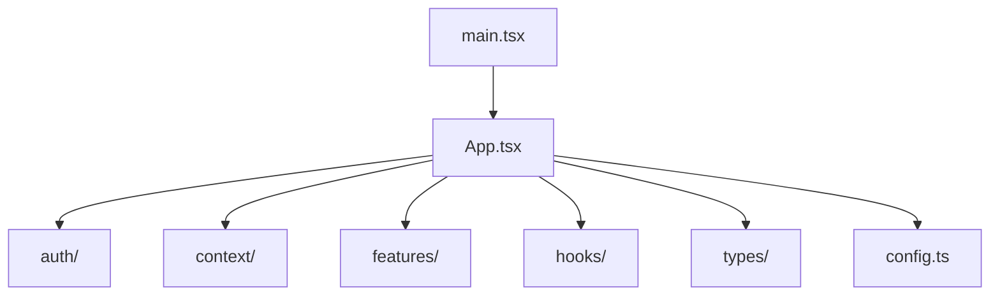

# MCPhappey.Clients.Web

React web client for discovering and interacting with MCP servers via a user-friendly interface.

## Architecture



## Key Features
- Lists available MCP servers
- User-friendly web interface
- Built with React, Bootstrap, and @modelcontextprotocol/sdk

## Usage

```sh
npm install
npm run dev
```

## Dependencies
- React 19
- @modelcontextprotocol/sdk
- Bootstrap
